# 项目名称

这里写项目的各类介绍信息，例如：

- 项目背景、动机等简介内容
- 项目内容目录
- ....

## Roadmap

```mermaid
graph LR
A[第一部分Streamlit基础知识介绍] --> A1[1.1 Streamlit的安装与Hello World]
A --> A2[1.2 Streamlit的文本图像音视频等元素]
A --> A3[1.3 Streamlit的按钮,单选框,复选框,滑块等交互组件]
A --> A4[1.4 Streamlit的布局与页面美化]
A --> A5[1.5 Streamlit与Matplotlib Plotly等可视化库的结合]

B[第二部分计算机史话节选] --> B1[2.1 第1-2集 早期计算机历史的时间线与图片展示]
B --> B2[2.2 第10-11集 早期编程方式的可视化与交互式演示]
B --> B3[2.3 第22-25集 命令行界面与GUI的可视化对比个人计算机历史照片墙]

C[第三部分程序设计 数据结构与算法  可以对标到datawhale算法刷题课,拿个例子来做可视化 ] --> C1[3.1 第12集 编程基础概念的可视化与交互式演示变量判断循环等]
C --> C2[3.2 第13集 基本算法的可视化演示如排序算法]
C --> C3[3.3 第14集 基本数据结构的可视化如栈队列树图等]
C --> C4[3.4 第15集 图灵机的可视化模拟  邓俊辉老师那里看到过,很酷炫 ]

D[第四部分计算机组成原理] --> D1[4.1 第3-4集 布尔逻辑与逻辑门的可视化模拟]
D --> D2[4.2 第5-6集ALU与寄存器的可视化模拟]
D --> D3[4.3 第7-9集CPU的工作原理可视化取指译码执行等]
D --> D4[4.4 第17集硬件发展历程可视化如摩尔定律曲线]

E[第五部分操作系统] --> E1[5.1 第18集操作系统基本概念可视化如进程线程调度等]
E --> E2[5.2 第19集内存管理可视化,如分页分段虚拟内存等]
E --> E3[5.3 第20集文件系统可视化,如目录结构文件分配等]
E --> E4[5.4 第21集数据压缩算法可视化如霍夫曼编码]

F[第六部分计算机网络] --> F1[6.1 第28集计算机网络基础可视化如网络拓扑协议层次等]
F --> F2[6.2 第29集网际协议可视化,如IP TCP UDP等]
F --> F3[6.3 第30集万维网可视化,如HTTP请求响应过程]
F --> F4[6.4 第31-33集网络安全与加密算法可视化,如对称加密非对称加密等]

G[第七部分人工智能  可以多多对标Datawhale其他课程 ] --> G1[7.1 第34集机器学习基础可视化,如监督学习非监督学习等]
G --> G2[7.2 第35集计算机视觉可视化,如图像分类目标检测等]
G --> G3[7.3 第36集自然语言处理可视化,如词云情感分析等]
G --> G4[7.4 第37集机器人可视化如,运动控制路径规划等]
G --> G5[7.5 第38集人工智能伦理与安全可视化]

H[第八部分Streamlit进阶] --> H1[8.1 Streamlit的状态管理与会话控制]
H --> H2[8.2 Streamlit的数据缓存与计算加速]
H --> H3[8.3 Streamlit的应用部署如Streamlit Share等]
H --> H4[8.4 Streamlit的应用安全与权限控制]
H --> H5[8.5 Streamlit与Gradio等其他框架的比较]
H --> H6[8.6 课程回顾与未来展望]
```

## 参与贡献

- 如果你想参与到项目中来欢迎查看项目的 [Issue]() 查看没有被分配的任务。
- 如果你发现了一些问题，欢迎在 [Issue]() 中进行反馈🐛。
- 如果你对本项目感兴趣想要参与进来可以通过 [Discussion]() 进行交流💬。

如果你对 Datawhale 很感兴趣并想要发起一个新的项目，欢迎查看 [Datawhale 贡献指南](https://github.com/datawhalechina/DOPMC#%E4%B8%BA-datawhale-%E5%81%9A%E5%87%BA%E8%B4%A1%E7%8C%AE)。

## 贡献者名单

| 姓名 | 职责        | 简介       |
| :--- | :---------- | :--------- |
| 小明 | 项目负责人  | 小明       |
| 小红 | 第1章贡献者 | 小明的朋友 |
| 小强 | 第2章贡献者 | 小明的朋友 |

*注：表头可自定义，但必须在名单中标明项目负责人*

## 关注我们

扫描下方二维码关注公众号：Datawhale

## LICENSE

`<a rel="license" href="http://creativecommons.org/licenses/by-nc-sa/4.0/">``</a> `本作品采用`<a rel="license" href="http://creativecommons.org/licenses/by-nc-sa/4.0/">`知识共享署名-非商业性使用-相同方式共享 4.0 国际许可协议`</a>`进行许可。

*注：默认使用CC 4.0协议，也可根据自身项目情况选用其他协议*
